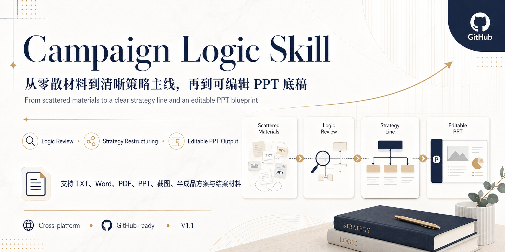
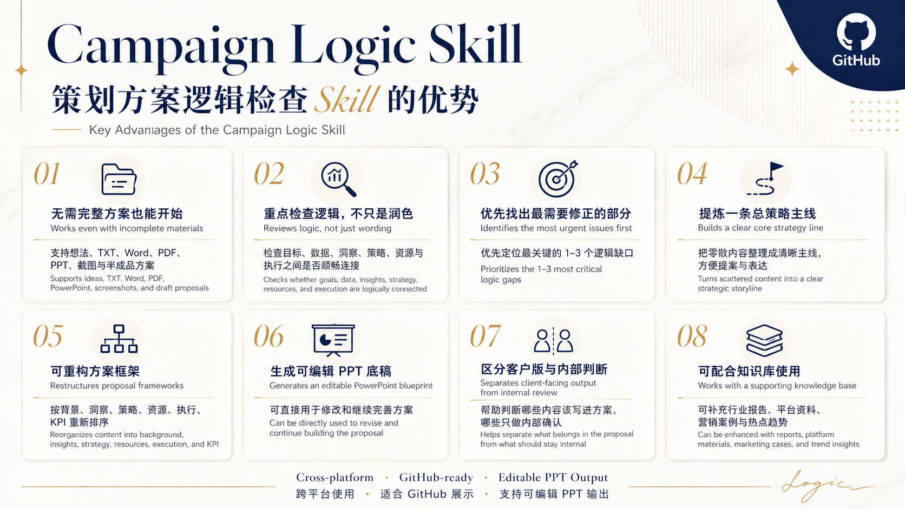

[English](README.md) | [简体中文](README.zh-CN.md)

# Campaign Logic Skill

A cross-platform skill for reviewing, restructuring, and improving marketing campaign proposals.

It supports rough ideas, outlines, TXT files, Word documents, PDFs, PowerPoint files, screenshots, incomplete proposals, complete proposals, and campaign closing reports.



## What It Does

Campaign Logic Skill helps users:

- identify the maturity of proposal materials
- detect broken or missing logic
- extract the most important issues to revise
- build a clear core strategy line
- restructure proposal flow
- distinguish client-facing content from internal analysis
- generate an editable PowerPoint blueprint
- continue analysis even when some data is unavailable

## Core Workflow

Material review  
→ Role identification  
→ Proposal maturity assessment  
→ Proposal type recognition  
→ Overall judgment  
→ Logic diagnosis  
→ Core strategy extraction  
→ Proposal restructuring  
→ Editable PowerPoint blueprint

## Supported Proposal Types

- Campaign proposals
- General proposal frameworks
- Individual campaign proposals
- Campaign closing reports
- Mixed-format proposal materials

## Editable PowerPoint Blueprint

The skill can generate an editable PowerPoint draft based on the proposal review.

The output may include:

- material assessment
- the most important logic issues
- a one-sentence core strategy
- a step-by-step strategy line
- a restructured proposal outline
- page-by-page editing boards
- missing information placeholders
- internal review notes

The PowerPoint output is designed as an editable logic blueprint, not as a final visual design.

## Supported Agent Environments

This repository can be used with tools that support project instructions, Markdown-based skills, system prompts, or repository-level rules, including:

- OpenAI Codex
- Codex Cloud
- Claude Code
- Other similar Agent tools

## Codex Setup

1. Clone or download this repository.
2. Place the repository files in your project root.
3. Make sure `AGENTS.md` and `SKILL.md` are available.
4. Ask Codex to read the relevant files before reviewing your proposal.

Example prompt:

```text
Please read AGENTS.md and SKILL.md first.
Then select the appropriate workflow from the workflows folder
and review the marketing proposal I provide.

## Claude Code Setup

1. Clone or download this repository.
2. Place the repository in your Claude Code project folder.
3. Make sure `CLAUDE.md` and `SKILL.md` are available.
4. Ask Claude Code to read the relevant workflow before reviewing your proposal.

Example prompt:

```text
Please read CLAUDE.md and SKILL.md first.
Then select the appropriate workflow based on the proposal material.
```

## WorkBuddy and Other Agent Tools

If the platform supports knowledge files, project instructions, or system prompts:

1. Upload `SKILL.md`.
2. Upload the relevant files from the `workflows/` folder.
3. Upload `AGENTS.md` as a project rule or supporting instruction.
4. Upload the proposal materials you want to review.
5. Ask the Agent to read the rules before starting the analysis.

Example prompt:

```text
Please read SKILL.md and AGENTS.md first.
Then select the appropriate workflow based on the materials I provide.
```

## Knowledge Base

This skill can be used together with a supporting Tencent ima knowledge base.

Knowledge base link:

https://ima.qq.com/wiki/?shareId=749ceceb753eac5742dc93d51c7318da96b63100624e1c45624836cbcd60d279

The knowledge base includes:

- platform materials
- industry reports
- consumer research
- marketing cases
- platform rules
- methodologies
- current trends

Notes:

- WeChat login may be required
- access is generally more reliable in mainland China
- overseas users may not be able to open the link
- the skill can still work independently without the knowledge base

## Repository Structure

```text
campaign-logic-skill/
├─ README.md
├─ README.zh-CN.md
├─ SKILL.md
├─ AGENTS.md
├─ CLAUDE.md
├─ CHANGELOG.md
├─ manifest.json
├─ assets/
├─ workflows/
├─ knowledge/
├─ examples/
└─ tests/
```

## Current Version

Version 1.1

New in this version:

- editable PowerPoint blueprint
- one-sentence core strategy
- strategy line restructuring
- proposal outline restructuring
- page-by-page editing boards
- separation between client-facing and internal content

## License

MIT License
