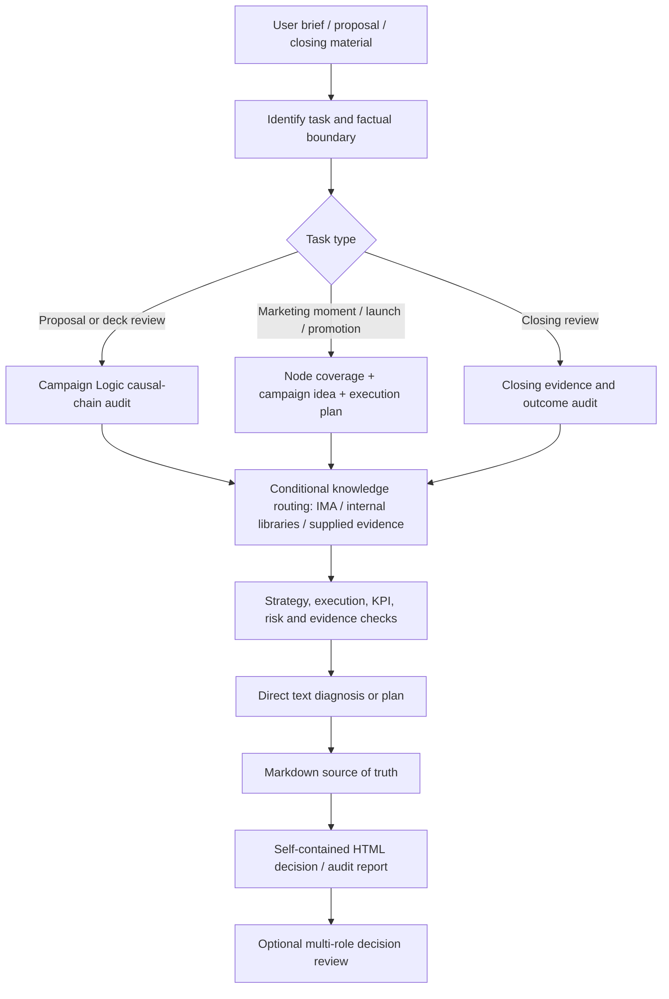

\[English\] \| [简体中文](README_CN.md)

# AI Marketing Strategy Skill

> From Campaign Logic Engine to a complete AI-powered marketing strategy
> workflow

AI Marketing Strategy Skill is an AI-assisted marketing strategy system
evolved from Campaign Logic Skill.

It helps marketing planners, brand teams, advertising professionals, and
business teams analyze requirements, review proposal logic, apply
methodologies, access knowledge resources, and improve presentation
quality.

## Release v3.0: Tested Direct-Audit Delivery

This release was iterated through multiple realistic marketing tests: proposal-logic review, marketing-moment planning, trend and risk handling, multi-role review, campaign closing review, and proposal audit. It now delivers an evidence-bounded text diagnosis plus formal report artifacts without making a user supply missing context before the review starts.

------------------------------------------------------------------------

# Core Capabilities

## Marketing Requirement Analysis

-   Analyze client briefs and business objectives
-   Identify marketing challenges and missing information

## Campaign Logic Review

-   Review objectives
-   Check insight and strategy logic
-   Evaluate execution paths and measurement frameworks

## Deep Proposal Review, Campaign Ideas & Execution

-   Diagnose the full Brief → business problem → insight → strategy → Core Idea → execution → KPI causal chain
-   Classify findings as missing, weak, broken, conflicting, generic, unexecutable, or reusable, with source-grounded repair examples
-   Create three or more distinct creative territories for marketing moments, launches, promotions, and events
-   Turn strategies into phased actions with owners, deliverables, channel handoffs, conversion paths, media tests, risks, and KPI maps

## Visual Decision Support, Direct Audits & Marketing Moments

-   Embed applicable methodology and strategy-presentation assets for objective repair, timelines, and proposal structures
-   Use node playbooks, including Teacher's Day, to create concrete, differentiated campaign mechanics
-   Scan current platform trends with source, capture date, safety checks, and durable fallback routes
-   For substantive uploaded proposals/decks, generate a direct text audit plus a Markdown audit source and self-contained HTML audit report
-   For closing reviews, generate the same formal audit-report set rather than stopping at a text conclusion
-   Keep factual boundaries, evidence ledgers, issue cards, repair routes, client/internal separation, and next steps in the report

## How It Works

The following Mermaid source is the recommended README application-flow diagram. It is suitable for GitHub rendering and can also be reused as a brief for a designed flowchart.

```mermaid
flowchart TD
    A[User brief / proposal / closing material] --> B[Identify task and factual boundary]
    B --> C{Task type}
    C -->|Proposal or deck review| D[Campaign Logic causal-chain audit]
    C -->|Marketing moment / launch / promotion| E[Node coverage + campaign idea + execution plan]
    C -->|Closing review| F[Closing evidence and outcome audit]
    D --> G[Conditional knowledge routing: IMA / internal libraries / supplied evidence]
    E --> G
    F --> G
    G --> H[Strategy, execution, KPI, risk and evidence checks]
    H --> I[Direct text diagnosis or plan]
    I --> J[Markdown source of truth]
    J --> K[Self-contained HTML decision / audit report]
    K --> L[Optional multi-role decision review]
```

**Flow-label copy for designed diagrams:**

1. Receive material and establish factual boundary
2. Identify review, planning, node/launch, or closing task
3. Route only the necessary knowledge and strategy engines
4. Check causal chain, execution, KPI, risk, and evidence
5. Deliver direct text result and Markdown source
6. Generate shareable HTML decision/audit report
7. Run optional multi-role review and regenerate the same report if needed

## Strategy Methodology Library

Includes:

-   SWOT
-   PEST
-   3C
-   STP
-   SMART
-   3W
-   5W2H
-   SCQA
-   McKinsey Seven-Step Method
-   AISAS
-   AIPL
-   4P
-   Brand Positioning Triangle
-   HBG
-   HOOK
-   KISS

## Presentation Model Library

Provides structured presentation frameworks:

-   Marketing planning models
-   User journey models
-   Brand lifecycle models
-   Content marketing models
-   Growth models

## Supporting Knowledge Base

### Tencent ima

[Open the shared Tencent ima knowledge base](https://ima.qq.com/wiki/?shareId=749ceceb753eac5742dc93d51c7318da96b63100624e1c45624836cbcd60d279)

### Our Knowledge Base

Coverage:

-   Multiple platforms
-   Multiple industries
-   Industry reports
-   Consumer research
-   Marketing cases
-   Platform rules
-   Marketing methodologies
-   Trend insights

Supports:

Market understanding → Strategy development → Proposal validation →
Marketing execution

Usage limitations:

-   WeChat login via QR code may be required
-   May be inaccessible from overseas network environments
-   The first version does not rely on automatic connection
-   The Skill generates search topics and keywords; use ima results as attributable external evidence, not as a substitute for project facts
-   If ima cannot be accessed, continue with the supplied material, state the missing evidence, and provide a practical query route rather than blocking the task

## Marketing Expression Optimization

-   Improve professional wording
-   Optimize proposal language
-   Provide marketing terminology references

## Proposal Simulation

Simulate client questions:

-   Why this strategy?
-   Why this audience?
-   Why this channel?
-   How to measure results?

------------------------------------------------------------------------

# Architecture

User Input

↓

Workflow Engine

↓

Knowledge Routing

↓

Strategy Methodology

↓

IMA Knowledge Base

↓

Examples & Presentation Models

↓

Marketing Strategy Output

------------------------------------------------------------------------

# License

MIT License

See [LICENSE](LICENSE)
