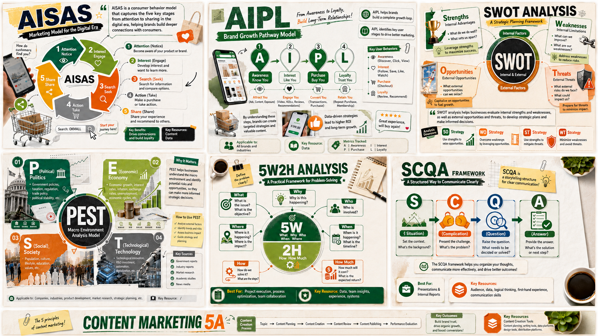
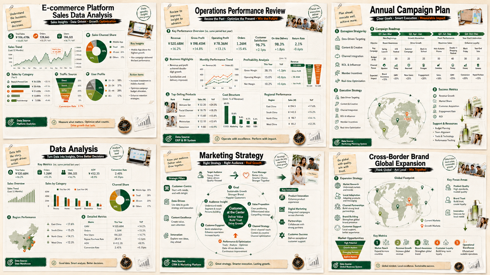
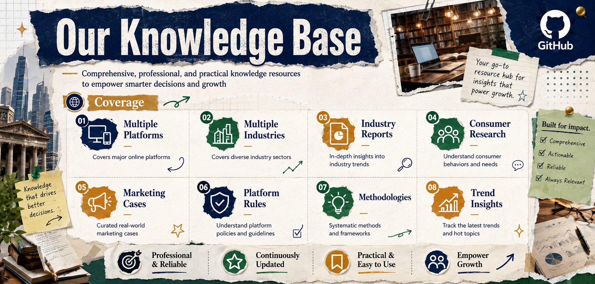

[English] | [简体中文](README_CN.md)

# AI Marketing Strategy Skill

> From Campaign Logic Engine to a complete AI-powered marketing strategy
> workflow

AI Marketing Strategy Skill is an AI-assisted marketing strategy system
evolved from Campaign Logic Skill.

It helps marketing planners, brand teams, advertising professionals, and
business teams analyze requirements, review proposal logic, apply
methodologies, access knowledge resources, and improve presentation
quality.

## Core Capabilities

### Marketing Requirement Analysis

-   Analyze client briefs and business objectives
-   Identify marketing challenges and missing information

### Campaign Logic Review

-   Review objectives
-   Check insight and strategy logic
-   Evaluate execution paths and measurement frameworks

### Strategy Methodology Library

Includes: - SWOT - PEST - 3C - STP - SMART - 3W - 5W2H - SCQA - McKinsey
Seven-Step Method - AISAS - AIPL - 4P - Brand Positioning Triangle -
HBG - HOOK - KISS

### Presentation Model Library

Provides structured presentation frameworks: - Marketing planning
models - User journey models - Brand lifecycle models - Content
marketing models - Growth models

### Supporting Knowledge Base

Tencent ima:

https://ima.qq.com/wiki/?shareId=749ceceb753eac5742dc93d51c7318da96b63100624e1c45624836cbcd60d279

**"Our Knowledge Base"**

Coverage:

- Multiple platforms
- Multiple industries
- Industry reports
- Consumer research
- Marketing cases
- Platform rules
- Marketing methodologies
- Trend insights

Supports:

Market understanding → Strategy development → Proposal validation → Marketing execution

Usage limitations:

* WeChat login via QR code may be required
* May be inaccessible from overseas network environments
* The first version does not rely on automatic connection
* The Skill generates search topics and keywords; users can manually search within ima
### Marketing Expression Optimization

-   Improve professional wording
-   Optimize proposal language
-   Provide marketing terminology references

### Proposal Simulation

Simulate client questions: - Why this strategy? - Why this audience? -
Why this channel? - How to measure results?

## Architecture

User Input

↓

Workflow Engine

↓

Knowledge Routing

↓

Strategy Methodology

↓

IMA Knowledge Base

↓

Examples & Presentation Models

↓

Marketing Strategy Output

## License

MIT License

See [LICENSE](LICENSE)
