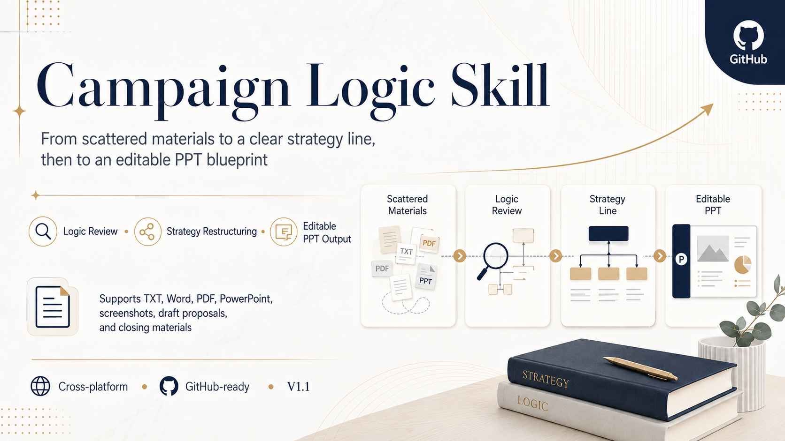

[English](README.md) | [简体中文](README.zh-CN.md)

# AI Marketing Strategy Skill

> From Campaign Logic Engine to a Full Marketing Strategy Agent

AI Marketing Strategy Skill is an AI-powered marketing strategy assistant designed to help marketers, strategists, brand teams, and consultants analyze, optimize, and structure marketing plans.

Originally developed as Campaign Logic Skill, the project has evolved from a campaign review framework into a broader marketing strategy system covering the full workflow from brief analysis to proposal preparation.

---

## Evolution

Campaign Logic Skill

↓

Campaign Logic Engine

↓

AI Marketing Strategy Skill

The original Campaign Logic capability remains as a core module inside the new framework.

---

# What It Does

## 1. Analyze Marketing Requirements

Understand:
- Client briefs
- Campaign requirements
- Marketing objectives
- Business challenges

Before generating solutions, the system evaluates whether enough information is available.

## 2. Build Marketing Strategies

Supports:
- Market analysis
- Consumer insights
- Competitive analysis
- Strategy development
- Growth planning

Methodologies:
- SWOT
- PEST
- 3C
- SMART
- SCQA
- AISAS
- AIPL
- 4P
- HBG
- KISS

## 3. Review Campaign Logic

Powered by Campaign Logic Engine.

Evaluates:
- Objective clarity
- Consumer insight quality
- Strategy consistency
- Creative logic
- Execution alignment
- User journey completeness

## 4. Improve Marketing Expression

Helps transform vague statements and marketing jargon into clearer strategic communication.

## 5. Recommend Presentation Models

Supports:
- User Journey Model
- AISAS Model
- AIPL Model
- Brand Strategy Framework
- Annual Marketing Planning Model
- Integrated Marketing Model

## 6. Proposal Simulation

Supports roles:
- Brand Manager
- Marketing Manager
- Product Manager
- Media / Performance Manager
- Operation Manager

---

# Architecture

AI Marketing Strategy Skill

├── Logic Layer
├── Knowledge Layer
├── Workflow Layer
└── Testing Layer

---

# Supported Platforms

- GPTs
- Claude Code
- WorkBuddy
- Codex-based Agents

---

# Why This Project Exists

Many marketing documents fail because of:
- unclear objectives
- weak strategy logic
- disconnected execution
- poor business communication

This project transforms marketing expertise into reusable AI workflows.

---

# License

MIT License
