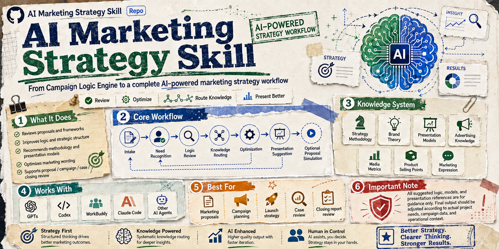

[English](README.md) \| [简体中文](README_CN.md)

# AI营销策略 Skill

> 从 Campaign Logic Engine 到完整营销策划 Agent

AI营销策略 Skill 是一个面向营销策划、品牌、广告、市场人员的 AI
辅助营销策略系统。

项目起源于 Campaign Logic Skill，最初用于帮助用户检查 Campaign
方案逻辑。

经过升级，现在扩展为覆盖：

需求分析 → 策略制定 → 知识调用 → 方案优化 → 表达优化 → 提案准备

的完整营销策略 Agent。

------------------------------------------------------------------------

# 项目演进

Campaign Logic Skill

↓

Campaign Logic Engine

↓

AI营销策略 Skill

原 Campaign Logic 能力不会被替代，而是作为核心逻辑模块继续保留。

------------------------------------------------------------------------

# 核心能力

## 1. 营销需求分析

帮助理解：

-   客户 Brief
-   商业目标
-   用户需求
-   营销挑战
-   信息缺失项

信息不足时，不直接生成完整方案，而是先识别需要补充的信息。

## 2. 策略方法论支持

支持：

-   市场分析
-   用户洞察
-   竞争分析
-   策略推导
-   增长规划

包含：

-   SWOT
-   PEST
-   3C
-   SMART
-   SCQA
-   AISAS
-   AIPL
-   4P
-   HBG
-   HOOK
-   KISS
-   麦肯锡七步法

## 3. Campaign逻辑审核

继承原 Campaign Logic Skill 能力。

检查：

-   营销目标
-   用户洞察
-   策略逻辑
-   创意一致性
-   执行动作匹配
-   用户路径完整性
-   指标设计合理性

## 4. 营销知识体系

包含：

-   策略方法论
-   品牌理论
-   方案呈现模型
-   广告知识
-   媒体指标
-   产品卖点
-   营销表达

## 5. 案例库与测试体系

案例库：

-   游戏上线营销案例
-   新品上市案例
-   品牌营销案例
-   社交媒体案例
-   方案审核案例

测试体系：

-   策略规划测试
-   Campaign审核测试
-   知识路由测试
-   输出质量测试

------------------------------------------------------------------------

# 项目架构

用户输入

↓

Workflow 工作流

↓

Knowledge Routing 知识路由

↓

营销知识模块

↓

案例与测试

↓

营销策略输出

------------------------------------------------------------------------

# 支持平台

-   GPTs
-   Claude Code
-   WorkBuddy
-   Codex Agent

------------------------------------------------------------------------

# License

MIT License

详见 [LICENSE](LICENSE)
