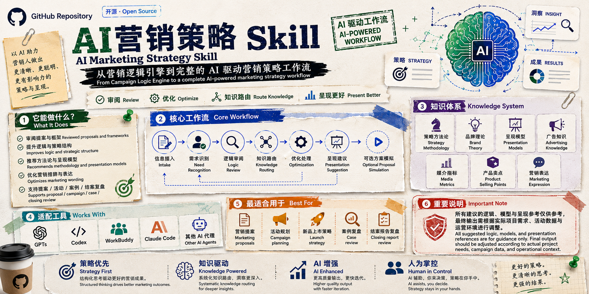
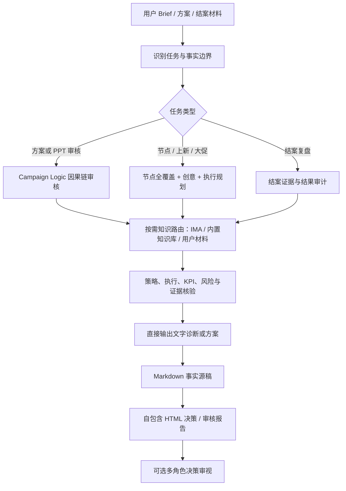
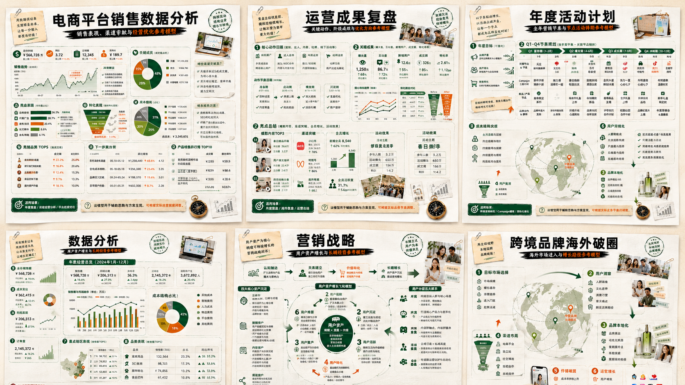
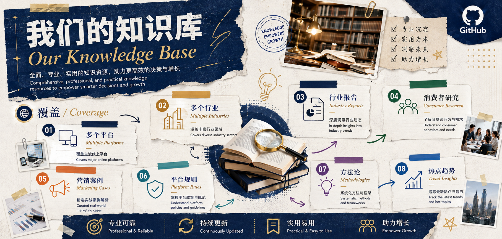

[English](README.md) \| \[简体中文\]

# AI营销策略 Skill

> 从 Campaign Logic Engine 到完整 AI 营销策略工作流

AI营销策略 Skill 是由 Campaign Logic Skill 升级而来的 AI
辅助营销策略系统。

帮助营销策划、品牌、广告及业务团队：

-   分析需求
-   审核方案逻辑
-   应用营销方法论
-   调用知识资源
-   提升方案呈现质量

## v3.0：经多轮实测的直接审核交付

本次升级基于多轮真实营销任务测试迭代，覆盖方案逻辑审核、节点创意、热梗与风险处理、多角色审视、结案复盘，合作方案审核。现在面对已上传的实质性方案/PPT，Skill 不会先因信息缺失要求用户补充，而是在事实边界内直接交付文字诊断与正式报告。

------------------------------------------------------------------------

# 核心能力

## 营销需求分析

-   分析客户 Brief
-   理解商业目标
-   识别营销挑战
-   发现信息缺失项

## Campaign 逻辑审核

-   检查营销目标
-   分析用户洞察
-   审核策略逻辑
-   优化执行路径
-   完善指标体系

## 方案深度诊断、节点创意与执行落地

-   沿着 Brief → 商业问题 → 洞察 → 策略 → Core Idea → 执行 → KPI 的因果链逐层诊断
-   将问题区分为缺失、薄弱、断层、冲突、空泛、不可落地和可保留，并给出基于原文的修改示例
-   面对节点、上市、大促和活动，提供至少三条真正不同的创意路线
-   将策略拆为分阶段动作、负责人、物料、渠道承接、转化链路、投放测试、风险与 KPI

## 可视化决策支持、直接审核与节点营销

-   在目标/KPI 修复、时间规划和方案结构场景中，推荐并展示适用的方法论与策略呈现图
-   提供教师节等节点的可执行玩法库，而非仅罗列活动名称
-   对当下热梗采用带来源、抓取日期、风险判断和替代路线的即时检索机制
-   对已上传的实质性方案/PPT，直接生成文字审核、Markdown 审核源稿和自包含 HTML 审核报告
-   对结案/复盘类材料，生成同样完整的正式审计报告，而不止停留在文字结论
-   报告保留事实边界、证据台账、问题卡、修订路线、客户/内部区分及下一步

## 应用流程

以下 Mermaid 源码可直接在 GitHub README 渲染，也可作为设计应用流程图时的结构与文案参考。

**用于设计流程图的节点文案：**

1. 接收材料，建立事实边界
2. 判断审核、规划、节点/上新或结案任务
3. 仅路由解决当前决策所需的知识与引擎
4. 核验因果链、执行、KPI、风险与证据
5. 直接交付文字结果和 Markdown 源稿
6. 生成可分享的 HTML 决策/审核报告
7. 需要时多角色审视，并回写同一份报告

## 策略方法论库

包含：

-   SWOT
-   PEST
-   3C
-   STP
-   SMART
-   3W
-   5W2H
-   SCQA
-   麦肯锡七步法
-   AISAS
-   AIPL
-   4P
-   奥美品牌定位三角
-   HBG
-   HOOK
-   KISS

用于：

-   市场分析
-   用户洞察
-   策略推导
-   增长规划

## 呈现模型库

帮助将策略转化为客户可理解的方案结构：

-   年度营销规划模型
-   用户旅程模型
-   品牌生命周期模型
-   内容营销模型
-   增长模型

## 配套知识库

### 腾讯 ima

[打开腾讯 ima 共享知识库](https://ima.qq.com/wiki/?shareId=749ceceb753eac5742dc93d51c7318da96b63100624e1c45624836cbcd60d279)

### 「我们的知识库」

覆盖：

-   多个平台
-   多个行业
-   行业报告
-   消费者研究
-   营销案例
-   平台规则
-   方法论
-   热点趋势

支持：

市场理解 → 策略制定 → 方案论证 → 营销执行

使用限制：

-   可能需要微信扫码登录
-   境外网络环境可能无法访问
-   第一版不依赖自动连接
-   Skill 会生成检索主题和关键词；ima 结果应作为可追溯的外部证据，不能替代项目事实
-   ima 不可访问时继续基于已提供材料完成任务，明确缺口并给出检索路径，不阻塞交付

## 营销表达优化

-   优化营销语言
-   提升方案专业表达
-   提供营销术语参考

## 提案模拟

模拟客户问题：

-   为什么选择这个策略？
-   为什么选择这个人群？
-   为什么选择这个渠道？
-   如何证明效果？

------------------------------------------------------------------------

# 项目架构

用户输入

↓

Workflow 工作流

↓

Knowledge Routing 知识路由

↓

策略方法论库

↓

IMA 知识库

↓

案例与呈现模型

↓

营销策略输出

------------------------------------------------------------------------

# License

MIT License

详见 [LICENSE](LICENSE)
